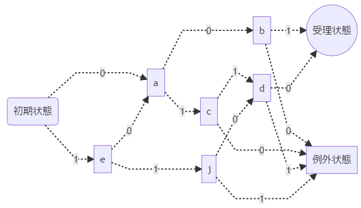

# 入門｜形式言語・オートマトン・チューリングマシン

## オートマトン

### 第一古代語
第一古代語には以下の5つの言葉が存在する

1. `001`
2. `10110`
3. `0110`
4. `1001`
5. `1100`

この5つの文字列は、それを受理できる有限オートマトンが存在するため、正則言語である

ここで、第一古代語を受理する決定性有限オートマトンのアーキテクチャを考えてみる

まず、`001`を受理するアーキテクチャをそのまま構成してみる（`000`というパターンは第一古代語に含まれていないため、例外状態にたどり着くようにしてある）

上記のアーキテクチャが`0110`を受理するように状態遷移を足してみると、以下のようになる

同様にして、`10110`, `1001`, `1100`を受理するように状態遷移を全て書き込むと、以下のようになる

このように、そのまま書き下すと状態遷移が複雑化してしまうが、よく見ると、いくつか同一の状態を示しているものがある

コツとしては、`受理状態`, `例外状態`に至る経路が同一である状態を探すことである

まず、`1 => 受理, 0 => 例外`という状態遷移をする`b`と`i`は同一状態とみなせる

同様に、`0 => 受理, 1 => 例外`という状態遷移をする`d`, `h`, `k`も同一状態とみなせるため、以下のようにまとめることができる

`受理状態`, `例外状態`に至る経路が状態`b`, `d`からの状態遷移に絞られたので、今度は、状態`b`, `d`に至る経路をまとめれば良い（`1 => d, 0 => 例外`より`c = g`）

同様に、`0 => b, 1 => c`より`a = f`

仕上げとして、`例外状態`に遷移する経路を行き止まりとしてしまえば、だいぶ見やすいオートマトン・アーキテクチャになる

