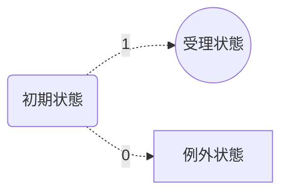
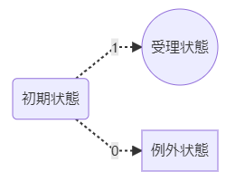

# 入門｜形式言語・オートマトン・チューリングマシン

## What's this?

- プログラマとしての能力を向上させるために、アーキテクチャを設計する力が必要になった
- そのために、コンピュータとは何か、計算とは何か理解する必要性を感じた
- よって、情報科学・認知科学の重要な基礎理論である形式言語・オートマトン理論について学ぶものである

***

## Reference

- 白と黒のとびら　オートマトンと形式言語をめぐる冒険
    - 川添愛・著、東京大学出版会
- 精霊の箱　チューリングマシンをめぐる冒険　上
    - 川添愛・著、東京大学出版会
- 精霊の箱　チューリングマシンをめぐる冒険　下
    - 川添愛・著、東京大学出版会

***

## オートマトン

### 決定性有限オートマトン

オートマトンとは以下のような仮想マシンである

- 状態をもつ
- 入力を受けると状態が遷移する
- 元の状態と遷移先の状態が同一であっても良い（遷移しなくても良い）

上記のようなオートマトンのうち、**もっている状態の数と受け付ける入力の数がそれぞれ有限個**であるものを**有限オートマトン**と呼ぶ

また、**現在の状態と入力の組み合わせによって遷移する先の状態が一意に決定される**オートマトンを**決定性オートマトン**と呼ぶ

この時、同じ状態にあって異なる入力を受け入れた場合、その遷移先が同一の状態になることはない

以上の定義より、決定性有限オートマトンとは以下のような仮想マシンである

- 有限個の状態をもつ
- 入力を受けると状態が遷移する
- 元の状態と遷移先の状態が同一であっても良い
- 受け付ける入力の種類が決まっている
- 現在の状態と入力の組み合わせにより遷移する先の状態がひとつに定まる
- ある状態において異なる入力を受けた時は、その遷移先が同一になることはない

---

### 正則言語

正則言語とは、それを受理できる有限オートマトンが存在する言語を指す

ここで、「有限オートマトンが入力を受理できる」とは以下のような状態を指す

- そのオートマトンは「初期状態」と「受理状態」という異なる状態を持つ
- そのオートマトンは、入力を受けて状態を遷移させる
- 全ての入力を受けて最終的にたどり着いた状態が「受理状態」ならば、受け入れた一連の入力は「受理可能な入力」であると定義する

例えば、単純な決定性有限オートマトンとして、以下のような仮想マシンを考える

- `初期状態`, `受理状態`, `例外状態`の3つの状態をもつ
- 入力として `0` or `1` を受け付ける

上記のようなオートマトンが、`1`を受理し、`0`を受理しないようにアーキテクチャを構成すると以下のようになる

